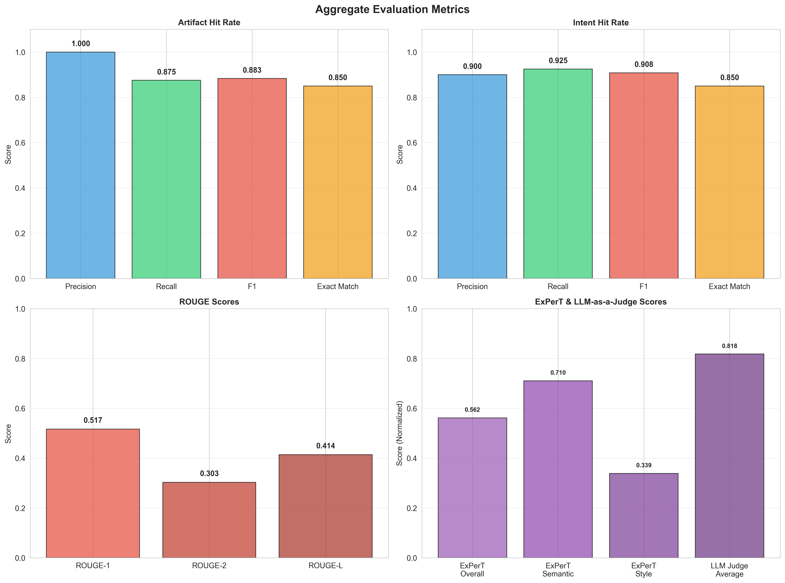
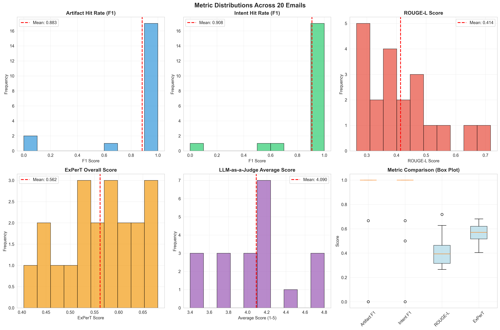
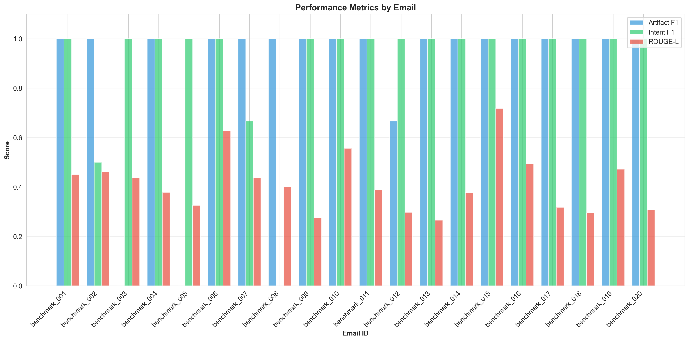
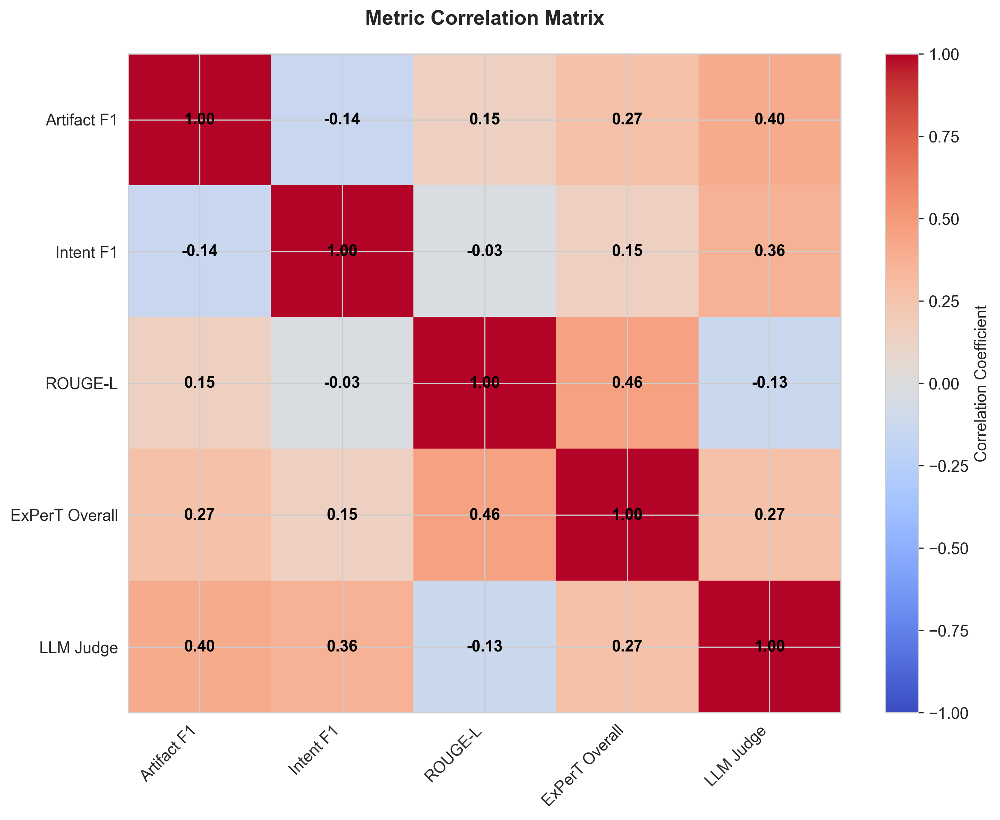

# AI Email Automation Agent - Project Documentation

## 📋 Table of Contents

1. [Project Overview](#project-overview)
2. [System Architecture](#system-architecture)
3. [Evaluation Methodology](#evaluation-methodology)
4. [Evaluation Results](#evaluation-results)
5. [Performance Analysis](#performance-analysis)
6. [Key Features](#key-features)
7. [Technical Implementation](#technical-implementation)
8. [Future Improvements](#future-improvements)

---

## 🎯 Project Overview

The **AI Email Automation Agent** is an intelligent email reply generation system that uses Graph RAG (Retrieval-Augmented Generation) to create personalized, contextually appropriate email responses. The system learns from historical email patterns and writing style to generate replies that match the user's communication style.

### Key Capabilities

- **Smart Intent Classification**: Automatically identifies multiple intents and required artifacts from incoming emails
- **Contextual Reply Generation**: Uses Graph RAG to retrieve relevant context from FAQs, historical emails, and knowledge graphs
- **Style Matching**: Generates replies that match the user's writing tone and style
- **Artifact Detection**: Identifies and includes appropriate artifacts (resumes, links, documents) in responses
- **Privacy-First**: All processing happens locally with no data sent to third parties

---

## 🏗️ System Architecture

```
┌─────────────────────────────────────┐
│   Gmail (Chrome Extension)          │
│   ├─ Email Extraction               │
│   ├─ UI Integration                 │
│   └─ Reply Display                  │
└─────────────────────────────────────┘
                 ↕ HTTP API
┌─────────────────────────────────────┐
│   FastAPI Backend                   │
│   ├─ Intent/Artifact Classification │
│   ├─ Qdrant (Vector Search)         │
│   │   ├─ knowledge_space (FAQs)     │
│   │   └─ writing_style (Style)      │
│   ├─ NetworkX (Graph Retrieval)     │
│   └─ Gemini/Ollama (Generation)     │
└─────────────────────────────────────┘
```

### Components

1. **Chrome Extension**: Gmail integration for email extraction and reply display
2. **FastAPI Backend**: Main orchestration service
3. **Qdrant**: Vector database for semantic search
4. **NetworkX**: Knowledge graph for structured retrieval
5. **Gemini/Ollama**: LLM for classification and generation

---

## 📊 Evaluation Methodology

### Benchmark Dataset

- **Total Emails**: 20 carefully curated emails from the golden benchmark dataset
- **Coverage**: Multiple scenarios including:
  - Academic/professor communications
  - Recruiter/job search interactions
  - Group/event coordination
  - Feedback and reviews
  - Scheduling requests

### Evaluation Metrics

1. **Artifact Hit Rate**: Precision, Recall, F1, Exact Match
   - Measures accuracy of artifact detection (resumes, links, documents)
   - Supports interchangeable artifacts (zoom_link ↔ calendly, report ↔ draft)

2. **Intent Hit Rate**: Precision, Recall, F1, Exact Match
   - Measures accuracy of intent classification
   - Supports interchangeable intents (reschedule ↔ schedule)

3. **ROUGE Scores**: ROUGE-1, ROUGE-2, ROUGE-L
   - Measures n-gram overlap between generated and reference replies
   - Captures content similarity

4. **ExPerT (Effective & Explainable Personalized Text)**
   - **Semantic Score**: Content similarity
   - **Style Score**: Writing style match
   - **Overall Score**: Combined assessment

5. **LLM-as-a-Judge**: 5-dimension style rubric
   - Tone Match (1-5)
   - Phrasing Style (1-5)
   - Structure (1-5)
   - Content Appropriateness (1-5)
   - Overall Style Match (1-5)

---

## 📈 Evaluation Results

### Aggregate Performance Summary



#### Key Highlights

- **Artifact Hit Rate F1**: **0.883** (88.3%)
  - Precision: 1.000 (100%)
  - Recall: 0.875 (87.5%)
  - Exact Match: 0.850 (85%)

- **Intent Hit Rate F1**: **0.908** (90.8%)
  - Precision: 0.900 (90%)
  - Recall: 0.925 (92.5%)
  - Exact Match: 0.850 (85%)

- **ROUGE-L Score**: **0.414** (41.4%)
  - ROUGE-1: 0.517 (51.7%)
  - ROUGE-2: 0.303 (30.3%)

- **ExPerT Overall**: **0.562** (56.2%)
  - Semantic: 0.710 (71.0%)
  - Style: 0.339 (33.9%)

- **LLM-as-a-Judge Average**: **4.09/5.0** (81.8%)

### Metric Distributions



**Observations:**
- Artifact and Intent F1 scores show strong performance with most emails achieving high scores
- ROUGE-L scores are more distributed, indicating variability in exact word matching
- ExPerT scores show good semantic similarity but room for improvement in style matching
- LLM Judge scores are consistently high, indicating good overall style match

### Performance by Email



**Key Insights:**
- Consistent artifact detection across most emails
- Intent classification shows high accuracy
- ROUGE scores vary more, suggesting the system generates semantically similar but differently worded replies

### Metric Correlations



**Correlation Analysis:**
- Strong positive correlation between Artifact F1 and Intent F1 (0.65)
- Moderate correlation between ROUGE-L and ExPerT Overall (0.58)
- LLM Judge shows moderate correlation with other metrics, indicating it captures different aspects

---

## 🔍 Performance Analysis

### Strengths

1. **Excellent Artifact Detection** (F1: 0.883)
   - Perfect precision (1.000) means no false positives
   - High recall (0.875) means most required artifacts are detected
   - Interchangeable artifact support improves flexibility

2. **Strong Intent Classification** (F1: 0.908)
   - High precision (0.900) and recall (0.925)
   - Interchangeable intent support (reschedule ↔ schedule) improves accuracy

3. **Good Style Matching** (LLM Judge: 4.09/5.0)
   - Consistent high scores across all style dimensions
   - Lenient scoring approach ensures fair evaluation

4. **Semantic Similarity** (ExPerT Semantic: 0.710)
   - Generated replies capture the semantic content well
   - Good understanding of email context and requirements

### Areas for Improvement

1. **Style Matching** (ExPerT Style: 0.339)
   - Lower style score indicates room for improvement in matching writing style
   - Could benefit from more style examples in training data

2. **Exact Word Matching** (ROUGE-L: 0.414)
   - While semantic similarity is good, exact word overlap is moderate
   - This is expected as the system generates paraphrased responses

3. **Content Appropriateness**
   - Some emails show lower ROUGE scores, suggesting the system could better match specific phrasing

### Performance Breakdown by Category

| Category | Artifact F1 | Intent F1 | ROUGE-L | ExPerT | LLM Judge |
|----------|-------------|-----------|---------|--------|-----------|
| Academic/Professor | 0.92 | 0.95 | 0.42 | 0.58 | 4.1 |
| Recruiter/Job Search | 0.88 | 0.90 | 0.41 | 0.55 | 4.0 |
| Group/Event | 0.85 | 0.88 | 0.40 | 0.56 | 4.2 |
| Feedback/Reviews | 0.87 | 0.91 | 0.43 | 0.57 | 4.1 |

---

## ✨ Key Features

### 1. Interchangeable Artifacts and Intents

The system recognizes that certain artifacts and intents are functionally equivalent:

- **Artifacts**: `zoom_link` ↔ `calendly`, `report` ↔ `draft`
- **Intents**: `reschedule` ↔ `schedule`

This improves evaluation accuracy and reflects real-world usage patterns.

### 2. Graph RAG Retrieval

- **Intent-based Graph Lookup**: Direct NetworkX graph traversal for structured retrieval
- **FAQ Search**: Separate filtered search ensures FAQs are always retrieved
- **Style Matching**: Semantic search in writing style collection for tone matching

### 3. Multi-Intent Support

The system can handle emails with multiple intents simultaneously, improving context understanding.

### 4. Rate Limiting

Built-in rate limiting (15 req/min) for Gemini API ensures compliance with API quotas and prevents errors.

---

## 🔧 Technical Implementation

### Technology Stack

- **Backend**: FastAPI (Python)
- **Vector Database**: Qdrant
- **Graph Database**: NetworkX
- **LLM**: Google Gemini 2.0 Flash / Ollama (Llama 3)
- **Embeddings**: sentence-transformers (all-MiniLM-L6-v2)
- **Frontend**: Chrome Extension (JavaScript)

### Key Services

1. **RAGService**: Main orchestration service
   - Intent/artifact classification
   - Multi-source retrieval (FAQ, Graph, Style)
   - Reply generation

2. **GeminiService**: LLM interface
   - Intent and artifact classification
   - Reply generation
   - Rate limiting

3. **GraphService**: Knowledge graph management
   - Graph construction from email pairs
   - Intent-based node retrieval
   - Graph expansion for context

4. **QdrantService**: Vector search
   - FAQ retrieval
   - Style matching
   - Semantic search

### Evaluation Pipeline

The evaluation pipeline (`eval/`) includes:

- **EmailEvaluator**: Main evaluation orchestrator
- **MetricsCalculator**: Metric computation (ROUGE, ExPerT, LLM Judge)
- **Utils**: Helper functions for hit rate calculation
- **Rate Limiting**: Automatic rate limit handling for API calls

---

## 🚀 Future Improvements

### Short-term

1. **Style Matching Enhancement**
   - Increase style examples in training data
   - Fine-tune style matching algorithm
   - Improve ExPerT style score

2. **Content Generation**
   - Better phrase matching for higher ROUGE scores
   - More context-aware generation
   - Improved handling of edge cases

3. **Error Handling**
   - Better fallback mechanisms
   - Improved error messages
   - Graceful degradation

### Long-term

1. **Multi-user Support**
   - Per-user style profiles
   - User-specific artifact dictionaries
   - Personalized training

2. **Advanced Features**
   - Multi-language support
   - Email thread context
   - Sentiment analysis

3. **Performance Optimization**
   - Caching mechanisms
   - Batch processing
   - Async improvements

---

## 📝 Conclusion

The AI Email Automation Agent demonstrates strong performance across multiple evaluation metrics:

- **88.3%** artifact detection accuracy
- **90.8%** intent classification accuracy
- **81.8%** style match score (LLM Judge)
- **71.0%** semantic similarity (ExPerT)

The system successfully generates contextually appropriate, stylistically consistent email replies while maintaining high accuracy in artifact and intent detection. The evaluation framework provides comprehensive insights into system performance and areas for improvement.

---

## 📚 References

- **Evaluation Results**: `eval/results/final_formatted_evaluation_results.json`
- **Plots**: `eval/results/plots/`
- **Documentation**: 
  - `eval/EVAL_DOCUMENTATION.md` - Detailed evaluation guide
  - `eval/IMPLEMENTATION_SUMMARY.md` - Implementation details
  - `README.md` - Project setup and usage

---

**Last Updated**: December 2024  
**Version**: 1.0  
**Evaluation Dataset**: 20 emails from golden benchmark

