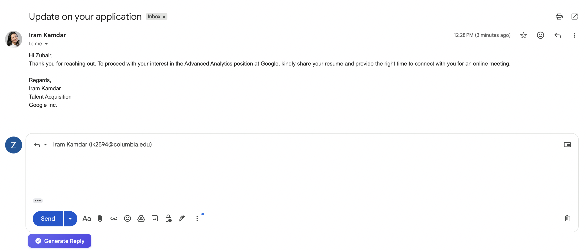
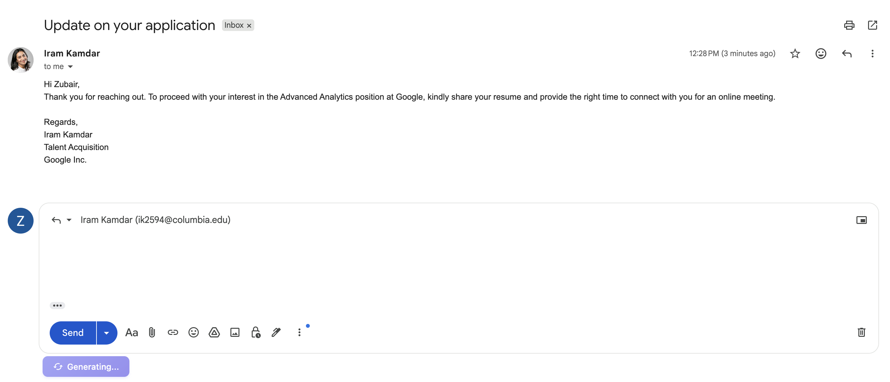
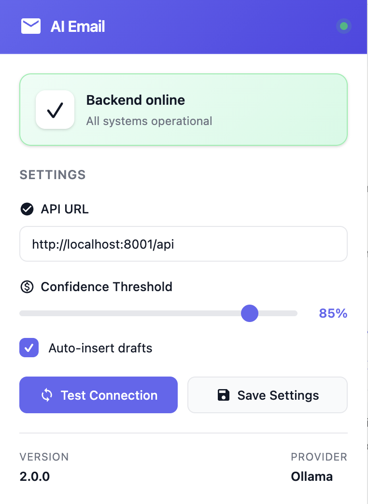
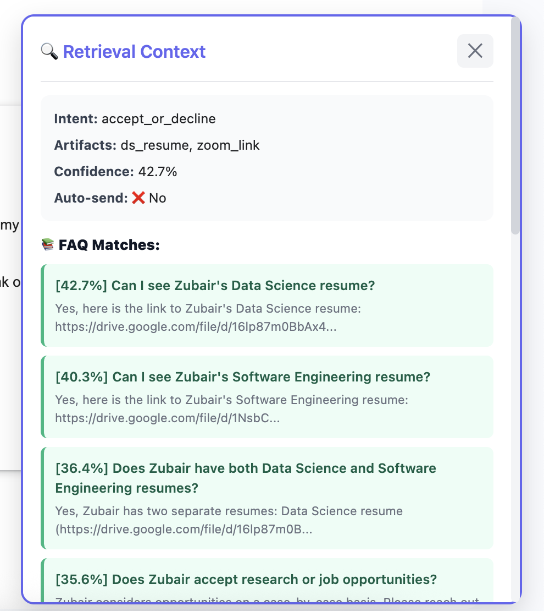
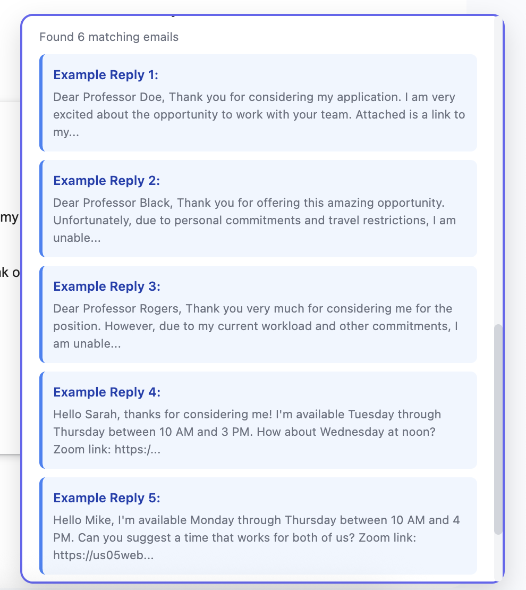
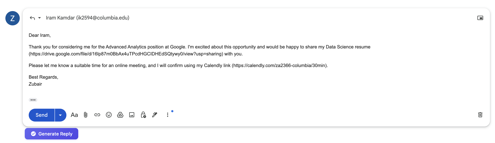

# Quick Installation Guide

## 🎯 Quick Start (5 minutes)

### Step 1: Start Backend

```bash
# From project root directory
cd /Users/zubair/Desktop/Dev/ai-automation-agent

# Option A: Use the startup script (recommended)
./start_backend.sh

# Option B: Manual start
source email-agent/bin/activate
python -m uvicorn backend.main:app --host 0.0.0.0 --port 8001 --reload
```

**✅ Success**: You should see "All services initialized successfully!"

### Step 2: Install Extension

1. Open Chrome: `chrome://extensions/`
2. Toggle **"Developer mode"** ON (top-right)
3. Click **"Load unpacked"**
4. Navigate to and select the `chrome-extension-v2` folder
5. Extension will appear with 📧 icon

### Step 3: Configure

1. Click the extension icon (📧) in Chrome toolbar
2. Verify API URL: `http://localhost:8001/api`
3. Click **"Test Connection"**
4. Should show: **"Backend online and healthy"** ✅

### Step 4: Use in Gmail or Outlook

#### Gmail:
1. Go to: https://mail.google.com
2. Open any email
3. Click **Reply**
4. Look for **"🤖 Generate Reply"** button
5. Click to generate!

#### Outlook:
1. Go to: https://outlook.live.com or https://outlook.office.com
2. Open any email
3. Click **Reply**
4. Look for **"🤖 Generate Reply"** button
5. Click to generate!

## 📸 Visual Guide













## 🐛 Troubleshooting

**Backend not starting?**
```bash
# Check Ollama is running
ollama list

# If not, start it
ollama serve

# Check dependencies
pip install -r requirements.txt
```

**Extension not working?**
- Refresh email page (Cmd/Ctrl + R)
- Check browser console (F12) for errors
- Reload extension at chrome://extensions/

**Button not appearing?**
- Make sure you clicked "Reply" first
- Wait 2-3 seconds (button appears periodically)
- Check browser console for errors

## ✨ What's New in v2

- ✅ **Outlook Support**: Works with Outlook.com and Office 365
- 🎨 **Modern UI**: Beautiful, minimalistic design
- 📊 **Better Status**: Real-time connection monitoring
- 🔍 **Context Panel**: See retrieval details

